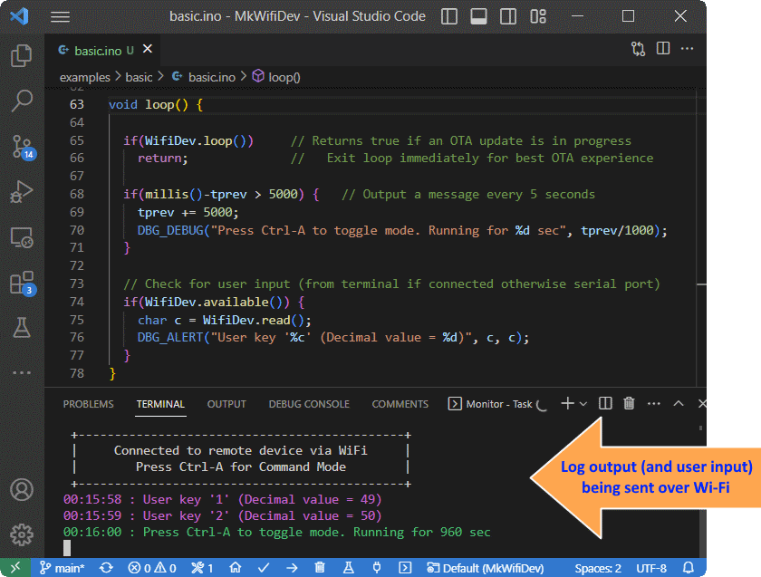

# MkWifiDev
This library provides a simple and convenient environment for cable-free development. It includes Arduino Over-the-Air (OTA) update support and provides easy to use logging to local serial port and a remote terminal. It allows logs to be saved to file and has message coloring - a surprisingly helpful feature!


## Features
- Arduino OTA update support
- Loging to serial, remote terminal and file 
- Log macros with variable arguments and 'printf' formatting
- Logging of data blocks formatted as hex dumps
- Message coloring (based on message type or set manually)
- Shows information including WiFi signal, restart reason, up-time & memory usage
- Remote software restart

## Command Mode
The library provides a **Command Mode** mode which is accessed by typing `Ctrl-A` into the serial or remote terminal. While in Command Mode log messages are muted and system information is shown in the terminal. It allows debug settings to be changed such as toggling the visibility of message timestamps or hiding certain message types. It also allows access to the software reset feature by pressing 'r' and then 'y' to confirm. Finally, when `Ctrl-A` is pressed again normal logging resumes.


## Installation
To install this library, use the Arduino Library Manager or download it from GitHub. In Platformio use `lib_deps = https://github.com/zaddi/MkWifiDev`
## Usage
To use this library, you need to include it:
```c++
#include <MkWifiDev.h>
```
Then you need to initialize the library within your setup() function:
```c++
WifiDev.begin(SSID, PASSWORD, DEVNAME); // Put your wifi+pwd here and enter a device name 
```
and add the following to the start of your loop() function:
```c++
  if(WifiDev.loop())     // Returns true if an OTA update is in progress
    return;              //   Exit immediately for best OTA experience
```
To output log messages, you can use one of the predefined macros below:
```c++
    DBG_VERBOSE("This is a verbose message");
    DBG_DEBUG("This is a debug message");
    DBG_INFO("This is an info message");
    DBG_WARNING("This is a warning message");
    DBG_ALERT("This is an alert message!");
    DBG_ERROR("This is an ERROR message!");
    DBG_CRITICAL("This is a CRITICAL message!");

    DBG_PRINT("This is a message with no level/coloring");
```


Verbose, debug, info & warning messages can be independently enabled/disabled using the **Command Mode** interface accessed by pressing `Ctrl-A` in the Serial or remote terminal. 
 
 You can use printf like formatting with any of these macros, for example:
```c++
    DBG_INFO("The value of x is %d", x);
```
Alternatively you can explicitly output a message with a specific color using DBG_CPRINT() as follows:
```c++
    DBG_CPRINT(MkWifiDev::Yellow, "It really is this easy!");
    // Available colors: White, Cyan, Green, BrightBlue, Yellow, Magenta, Red, BrightRed   
```
To display the contents of an array or an area of memory, use DBG_HEXDUMP():
```c++
    DBG_HEXDUMP("My buffer:", myBuffer, 16);
```
The above code shows 16 bytes of memory starting at the address of myBuffer[]. The output is formatted in hexadecimal.  An optional 4th argument can be used to set the message type, for example MkWifiDev::INFO (the default is VERBOSE).  

If you wish to add your own handling of user keystrokes, add similar code to if you were using Serial, for example you could add something like this to your loop() function:
```c++
  if(WifiDev.available()) {
    char c = WifiDev.read();
    DBG_ALERT("User key '%c' (Decimal value = %d)", c, c);
  }
```
This automatically takes user input from the remote terminal if connected, otherwise it uses the local serial port. Any serial input is ignored while a remote terminal is connected.

## Additional Features
### Application Name
If you define `_APPNAME_` to a string, this will be shown in the Command Mode header. For example, `build_flags = -D _APPNAME_= "MkTestApp"` was used in **platformio.ini** for the previous screenshot. It results in the text `| MkTestApp : Built March  2 2023 14:04:30 |`
### Internet Time Synchronization
The message timestamps will show the time since the system started unless the clock has been set.  If you add the following, the library will try to get the time from the Internet using NTP:
```c++
  WifiDev.configTime(GMT_OFFSET, DAYLIGHT_OFFSET);   // Sync localtime using NTP
```
An NTP time sync will be attempted whenever this function is called.  GMT_OFFSET is your timezone offset in seconds, for example (-5*3600) for US Eastern Time, and DAYLIGHT_OFFSET is your daylight savings offset (if active) in seconds, typically 0 or 3600.

### OTA Authentication
If you wish to enable password protection of OTA updates add the following after calling WifiDev.begin():
```c++
   ArduinoOTA.setPassword("admin");     
```
If using Platformio, you can use the following to your platformio.ini file:
```
   upload_flags = --auth=admin
```
*The above uses 'admin' as password, you may wish to use something more secure!*
### Change Serial Port
By default 'Serial' is used for log output.  The output stream may be changed at any time using the setSerial() function, for example:
```c++
  WifiDev.setSerial(Serial2);     // Change to using Serial2 for debug output
```
### Message Tags
By default no message source information is shown, but the following are available:
- **dbgTAG** - By default this is **null**. If the tag is assigned in a file, all future output in that file will include the tag value in the log messages.  For example `dbgTAG = "MyModule";` results in the following:
  ```21:31:31 : MyModule : Sample message with dbgTAG set```
*You can change the tag value at any time, or set it back to null to hide the tag*

- **DEBUG_SHOW_FILE** - If this is defined where a log message is output, the message will include the filename & line number where it was generated. This can be with a #define per file, or set globally with a build flag. The output will be something like:
  ```21:31:31 : another.cpp:10 : Sample message on line 10 of anther.cpp```

- **DEBUG_SHOW_FUNCTION** - If this is defined where a log message is output, the message will include the name if the calling function. This can be with a #define per file or globally with a build flag. The output will be something like: 
  ```21:31:31 : myFunction() : Sample message from inside myFunction```

### Logging to File
If you wish to store the log messages to file, simply provide the library with a valid open file:
```c++
      WifiDev.setLogFile(logFile);
```
- You need to open the file and handle any errors before passing the logFile to WifiDev.
- If storage space is limited you may need to take precautions, for example monitoring the file size and overwriting old log files when required.
### Display Mode Flags
There are configurable display mode flags that can be set or cleared using the functions below:
```c++
  WifiDev.setDisplayModeFlags(MkWifiDev::WIDE_HEXDUMP);         // Show wide hex dumps  
  WifiDev.clearDisplayModeFlags(MkWifiDev::SHOW_TIMESTAMPS);    // Hide timestamps
```
The table below lists the available flags, the ones in **bold** are set by default. Note that they can also be combined in the set/clear operations using the bitwise or operator '|'
| Flag | Description |
| ------ | ------ |
| **SHOW_TIMESTAMPS** | Display time information with each log message |
| SHOW_MILLISECONDS | Append milliseconds to timestamps (if enabled) |
| SHOW_DATE | Prepend date to the timestamps (if enabled) |
| **SHOW_COLOUR** | Enables coloring of log messages |
| SHOW_TYPE | Show a tag indicating the message type, for example [E] for error |
| WIDE_HEXDUMP | Sets the hex dump display width to 32 bytes instead of the default 16 |
### Build without Log Messages
If you wish to create a build without log messages you can individually exclude each message type (on a per file basis) by adding the following to your source file (before any log messages):
```c++
#undef DBG_VERBOSE                  // Undefine to avoid compiler warning
  #define DBG_VERBOSE(...)    { }   // Replaces the log macro with nothing
```
## Examples
You can view some examples of how to use the library in the examples folder:
- **Basic:** Demonstrates basic use of the library with remote support enabled.
- **Nowifi:** Shows how to use the library with remote support disabled
- **Full:** Comprehensive example including OTA authentication & logging to file

## Viewing the Log Messages
In order to view the log output on a remote computer and/or to view the message coloring, you can use Platformio's built-in monitor or otherwise use a terminal program such as [PuTTY](https://www.putty.org/).  Make sure to use Port 23 & set 'Connection type' to 'Raw'.

> In PuTTY set 'Terminal' | 'Local line editing' to 'Force off' if you wish to ensure terminal characters are sent immediately instead of waiting for enter to be pressed.

If you are using Platformio, use the following in **platformio.ini** to remotely monitor your device:
```
monitor_raw = yes                    ; Required to show text coloring
monitor_port = socket://DEVNAME:23   ; Or specify the IP (eg socket://192.168.0.101:23)
```
After uploading a build with OTA to your board, use the following in **platformio.ini** to perform further updates using OTA:
```
upload_port = DEVNAME               ; Or specify the IP (eg 192.168.0.101)
upload_protocol = espota
;upload_flags = --auth=admin        ; Uncomment and update the password as needed
```
## FAQ
- Why do my messages have weird stuff in them? Like `␛[36m00:00:00.043 : Starting MkWifiDev Demo␛[0m`
Those are control codes to change text color. You either need enable text coloring in your terminal program (see above) or disable text coloring using Command Mode ('Ctrl-a' then 'C'), or by clearing the **SHOW_COLOUR** flag in your code: ```WifiDev.clearDisplayModeFlags(MkWifiDev::SHOW_COLOUR);```

## License

This library is distributed under the relaxed MIT license.

## Acknowledgements

- STRINGIFY & TOSTRING macros  by [Curtis Krauskopf](http://www.decompile.com/cpp/faq/file_and_line_error_string.htm)
- Singleton implementation based on code posted by ['PieterP'](https://forum.arduino.cc/t/how-to-write-an-arduino-library-with-a-singleton-object/666625/2)

---
I hope this library helps make your coding more fun! 
Let me know if you find any bugs or have any ideas to make it better!😊